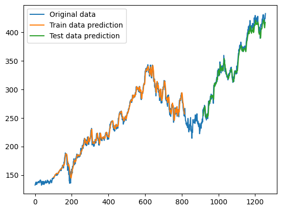

# stock_market_forecasting

<ul>
    <li>Stock market prediction and forecasting done using stacked LSTM model.</li>
    <li>Used tiingo API to get the stock price data of Google for the last 5 years.</li>
    <li>Trained the model using stacked LSTM model on the closing price data.</li>
    <li>Predicted price of the upcoming 30 days.</li>
</ul>

